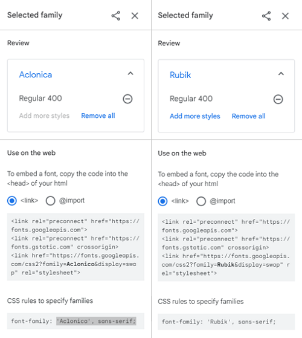
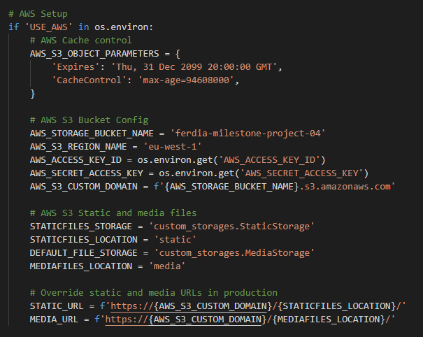

# Milestone Project 04 

### Spartan Fitness Club E-Commerce Store  

### Info for the Assessor

I have included the admin credentials in the comments section at project submission.

I have also included a folder which contains a test image if you wish to use it during testing, and a USER.txt file which has an addittional standard username and password if you wish to use it during testing, as well as creating your own.

[Test Image](assessor_folder/Test.jpg)

[Test User](assessor_folder/USER.txt)
  
For Stripe functionality at checkout I have used the following card details:

        - card number : 4242 4242 4242 4242
        - date : 04/24
        - CVV number : 242
        - ZIP : 42424

## Table of contents
1. [Introduction](#intro)
2. [Responsive Design](#responsive_design)
3. [My Project Description and Design](#project_description)
    1. [Wire Frames](#wire_frame)
    2. [Pop up Delete Modals](#pop_modal)
    3. [Nav Bar](#nav_bar)
    4. [Hero Image](#hero_image)
    5. [Page Links and Button Navigation](#page_links)
    6. [Flash messages](#flash_messages)
    7. [Search Products](#search_products)
    8. [No Image Default](#default_Image)
    9. [Footer](#footer)
4. [Utilising the 5 Planes of UX Design](#ux_design)
    1. [The Strategy Plane](#strategy_plane)
    2. [The Scope Plane](#scope_plane)
    3. [The Structure Plane](#structure_plane)
    4. [The Skeleton Plane](#skeleton_plane)
    5. [The Surface Plane](#surface_plane)
5. [Typography](#typography)
6. [User Stories/Testing](#user_stories_testing)
    1. [TESTING.md document](#external_document)
7. [Bugs and Fixes](#bug_fixes)
8. [References and Credits Section](#references_and_credits)
    1. [Technologies Used In The Project](#technologies_used)
    2. [Media](#media)
    3. [Adding the Blog & Blog Comments](#blog)
9. [Future "Nice to Have" Additions to The Website](#additions)
10. [My Data Base Layout and Structure](#db_structure)
11. [Deployment of Project](#project_deployment)
    1. [Heroku Deployment](#heroku_deployment)
    2. [Amazon AWS](#amazon_aws)
    3. [Local Deployment](#local_deployment)
12. [Previous Assessment Comments and How I Have Addressed Them](#previous_comments)
13. [Acknowledgements](#acknowledgements)
  

## Introduction 

My Milestone Project 4 was envisioned by me and created based on the knowledge gained so far from this course. 
I have taken the fundamentals that I have learned from the course and applied them to this website with style and format changes. 
I have created Python, Jscript and jQuery functions where required to manipulate data, undertake logic and enable the end result back to the user.
I hope that the outcome of my works has translated into a web application UI, that shows and facilitates my understanding of the Django framework learned throughout this development module.

The two additional models I have chosen to implement in my project are a Blog and a Blog Post Comment section. I am quite happy in there successful integration with the rest of the app. Please click [Here](media/readme_images/BLOG.png) to view a screeshot of one of the blogs with user commenting.

I also feel that further additions to the site can be made very easily by adding more models to the postgres database and tailoring the files within the app structure itself to suit. 
My goal was to create an application that visually appears accessible and familiar to sports and gym goers.
I also wanted to make it responsive and easy to navigate by using tailored css and css bootstrap classes.
As well as the course materials, there have been some additional code examples which I have searched for online and utilised.
These additions have been highlighted and referenced later on in this document (references and credits section).
As well as these additions I have received excellent feedback from my mentor Maranatha Ilesanmi throughout this course.
For the previous project, Maranatha has re-capped and explained the reasons for the comments I received. He has given me great advice again on how to improve so that I can attain a higher mark.
I have also added a [section](#previous_comments) in this README file, where I explain what has been implemented in this project to counter act the reasons for falling down in the last project.

## Responsive Design 

As can be seen in the screenshot below, media queries and Bootstrap classes have been used to ensure that the website is completely responsive across Desktop and Mobile devices.

View the deployed project here:[ SFC ](https://ferdia-milestone-project-04.herokuapp.com/)  

## My Project Description and Design 

The Spartan Fitness Club website is a full-stack responsive website which utilises Python, JQuery & javasript methods and functions to carry out CRUD functionality using the Django framework,
a Heroku postgres database and AWS static and media file storage. 
Please see initial envisioned wireframes for desktop and mobile devices (before project start) and actual screenshots of the finished website in the sections that follow:
  

### Wire Frames 

This time around, I found the wire-frames extremely helpful for planning the structure and navigation throughout the site. 
The main langing page is the centre hub for all users until logged in. From here all non-admin, and non-registered user options are available through the navbar.
There are additional options available if logged in as an admin, or a registered user which will be discussed further in the document.
A number of redirects are used and placed in known locations that users that would be familiar with in keeping with good practise.

Please see below links to individual Mobile & Desktop views:

[Home Page](media/readme_images/Main_Page.png)

[Products](media/readme_images/All_Products_Page.png)

[Product Detail](media/readme_images/Product_Detail.png)

[Add/Edit Product](media/readme_images/Add_Edit_Product.png)

[Blog](media/readme_images/All_Blogs.png)

[Blog Detail](media/readme_images/Blog_Detail.png)

[Add/Edit Blog](media/readme_images/Add_Edit_Blog.png)

[Profile](media/readme_images/Profile.png)
  

### Pop up Delete Modals 

There are 3 pop up modals used on this application. All three modals are used in conjunction with the delete options for products, blog posts, and comments.
It is a way of protecting against accidental deletion of each item by providing the user with a way of opting out if delete was pressed accidentally, 
and a way of giving the user a second chance to re-consider if they had decided to delete the item but now have changed their mind.
  

### Nav Bar 

This project has a Fixed nav-bar and five sub-sections "All Products, Clothing, Gym, Special Offers and Blog". Once the page is scrolled the navbar follows. 
I felt that having the navbar quickly accessible from all locations of the website would benefit a potential shopper and it keeps in-line with professional sites I am familiar with.
Easy acces to the "Log In", "Log Out" and shopping bag pages are possible through the "My Account" Icon's dropdown menu and the "Shopping Bag" Icon link.
The nav-bar can be separated up into desktop (as seen above) and mobile views as seen below. 
Clicking the "Spartan Fitness" logo re-loads the main page and re-directs you back there if clicked from another location on the site.
Clicking the "All Products" link navigates the user to the all products page, displaying all products in the e-commerce store.
Clicking the "Clothing" link allows the user to see products that fall into the clothing section.
Clicking the "Gym" link allows the user to see products that fall into the gym section.
Clicking the "Special Offers" link allows the user to see products that fall into the special offers section.
Clicking the "Blog" link navigates the user to the Blog post section of the website.
The "Free Delivery Threshold" banner is static, unclickable and remains in place throughout the site.

  

### Hero Image 

The Hero Image that loads upon display of the main page is of a large gym facility which shows alot of differing fitness equipment.
The image contains all of the primary colours in the centre of the image (weights), and it has a lerge quantity taken up by the colour green.
I added a blue hue to the image in photoshop which has allowed the use of purples,blues and greens which now I feel mix quite well.
The image is responsive accross all sizes of device by utilising css classes.
  

### Page Links and Button Navigation 

In the image above I have placed all the href, onClick and submit type button navigations used in this project. 
All links have been incorporated with huge consideration to the users overall experience and ease of use.
It is my intention here to have the user feel a sense of familiarity by keeping everything quite similar to UI's, websites and layouts that I am familiar with using myself.
I have tried to make sure that every feature here conforms to modern best practise standards.
All links have been tested and are fully functional. The social media links in the footer open in separate tabs where required.
  

### Flash Messages 

I have kept the Flash messages being presented back with similar styling as the flash messages in the Boutique Ado project as I really liked how they presented.
They definitely fit very well with the theme I have implemented.
The messages appear consistently at the top right of the screen under the shopping bag and convey success, error, info and warning messages.
The alert messages appear with differing colours, linked with the bootstrap classes of colours for severity.
The messages disappear when the user clicks on the "X" located at the top right of the message.
A minified version of the shopping bag appears within the success message when items are added.
  

### Search Products 

The search products search bar will query the product name and description fields in the Heroku postgres database.
The user just has to type their query and then click or press "Search". The query will return items that match the descriptive search text entered.
For example, in the screenshot above, I have queried the word "shorts" and two products have returned. With the products returned,
you then have the option to sort the returned results by "Price, Rating, Name and Category". Each of those sorting methods can also be reverse ordered.
  

### No Image Default

The default no image file is used for times when the url link may not be available, or when the user has forgotten or chosen not to upload an image.
  

### Footer 

I have kept the footer very simple so not to distract from what is taking place on the rest of the main page.
While being simplistic all its functions work really well. 
Its contains the following:
1. Heading text.
2. Three hover and clickable social media Icons.
3. A contact us link which generates an mailto link with your default email client (as seen below).
4. Copyright text which updates its year with the current year through an inline javascript function.
  

  

## Utilising the 5 Planes of UX Design 

**The Strategy Plane** 

The strategy plane here is concerned with attracting individuals who are into fitness and excercise, or those who are thinking of getting into it and considering membership options.
The main business objectives of SFC are to sell their e-commerce store products online, sell gym memberships, meal plans and promote themselves as as fitness advice and training experts (blog).
As the company grows I envision them selling more and more third party offerings through the store, making it ever more important to have a quick and easy method of adding products.
I believe the use of the blog and interactive commenting to promote upcoming events will generate large interest in the company.

**The Scope Plane** 

The app, I feel, utilises modern techniques to be in line with what is current, and trys to enhance the users experience by keeping everything sports related and familiar. 
The navbar structure will be a very familiar feature to most e-commerce users and incorporates the necessary links for logging in and signing up through the "My Account" icon.
The search bar I have kept centered and familiar looking also, and the text for the dropdown menus, I think, pre-define what is expected when the user presses them.
The displayed all products and all blogs, as well as detailed product and blog views have intuitive buttons associated with each of their views for navigating, submission, editing and deleting.
Upon all user interactions where a submission occurs (Log In, Log Out, CRUD, checkout) the user is presented with [flash messages](#flash_messages) to confirm the status of their request.
The "Add Product"/"Edit Product" and "Add Blog"/"Edit Blog" pages are designed to be very simple and easy to follow and fill out. 
The items are filled out in the order that they are displayed which will lead to better familiarity from repitition by the admin user.
The checkout page keeps in-line with what is common and modern, utilising Strip payments to complete the purchasing of products.

**The Structure Plane** 

This app is a multi-page page layout that extends from the base.html template. I have tried to keep everything simplistic and familiar.
It is navigated from top to bottom with a fixed nav-bar at the top and a footer at the bottom of the main page only. 
The nav-bar turns into a mobile friendly toggler once below a specific resolution. Underneath the nav-bar is where the “Hero-Image” is located.
The hero image is consistently placed accross all pages and has an opacity overlay for every page except the home page.
The hero image and home text are [responsive](#responsive_design) accross desktop and mobile as can be seen in previous screenshots.
The logo text and "Shop Now" button are only visible on the main page. The items common to all pages are the hero image, the navbar and the free delivery threshold banner.

If you are not a registered user, you will have pretty much full access to the site (even to make a purchase) without the option to store and view order related data, or comment on blog posts
If you are an existing user, after logging in you will have access to your profile page to view historical order data and you will be able to comment on the various blog posts that exist. 

The profile page contains historical order details, as well as a saved version of your delivery details which can be updated and saved by the user at any point.
These details are then used to populate the delivery form on the checkout page when making a purchase.

User interactions accross the site will be intuitive, familiar and consistent on all pages to ensure the user has a great UX experience.
Hoverable and clickable links, buttons are used throughout the app to present the user with easy and expected navigation results.
The hover effects will be a change in background colour (darker), and the moise pointer will change to a finger pointer when on top of clickable items.

**The Skeleton Plane** 

The app will have a consistently placed background image which will be responsive and appear on all pages (opacity layer, on top, on every page except the main page).
The use of [colours](#colours), [fonts](#typography) and responsive elements were carefully chosen to add user expected functionality.
Careful consideration was given to making the content well placed, clear and well presented. This was achieved by utilising contrasting colours, 
right size, style fonts and adequate spacing. In order to try and create a professional feel I was quite selective with the product images used from Unsplash.com
In this project, the Balsamic [wire frames](#wire_frame) have been a fantastic tool to envision what the end result would be.
There have been some subtle changes to the placement of elements and styles from what was originally envisioned through the wireframes.
The page is scrolled top to bottom with a "Scroll To Top" feature displaying in the bottom right margin when the page is scrolled beyond 100px.
This feature only appears on pages where the content is expected to require it.

**The Surface Plane** 

The colours and imagery used on this website, I feel, are really in line with the sports and fitness theme.
The hero image and a sports jersey that I own were the inspiration for the entire colour theme.
I have kept greens/blues as my main colour with a contrasting purple for highlighting links.
I have used white and black in standard and opaque styles where I think further contrasting is required to allow for element separation.
The remaining colours used throughout the project were picked based on complimenting the existing colours.
The palette picker I used to assist my choices was created at [www.coolers.co](https://coolors.co/) 

I have used subtle background shading to highlight certain text elements and the hovering and clicking of items throughout.
Keeping in line with modern UX standards, Hovering over links, buttons and text selectors causes the elements to change colour, alerting the user to the presence of their mouse pointer.
  

## Typography 

The fonts used for the milestone project are: “Aclonica” and “Rubik”.

Both fonts were located and used from Google Fonts:[ Aclonica ](https://fonts.google.com/specimen/Aclonica?query=aclonica), [ Rubik ](https://fonts.google.com/specimen/Rubik?query=rubik)

I felt the contrast between Aclonica and Rubik works really well. I picked Aclonica based on the name of the website, Spartan Fitness Club. I thought the capitol letter A looked like a Spartan Warriors helmet.
I feel the bold, thick font of Aclonica with subtle shading has really played a part in defining the brand and definitely keeps in line with the warrior/gym fitness theme.
I have made subtle changes to the font colors, shadows, sizes and spacings for contrasting & responsiveness as can be seen on the finished app and in the base.css sheet. 
  

## User Stories/Testing 

**Testing Document** 

For this project I have created a separate testing document which details the user stories and the user testing.
Inside the testing document there are also 2 links to pdf spreadsheets. The first spreadsheet was used to create the user stories and the second 
is an excerpt from the complete manual user testing PASS Sheet which covered all app functionality and expected results.
Please click on this link: ["TESTING"](TESTING.md) to view the testing document and please click on the pdf links inside the document when required.
  

## Bugs and Bug Fixes 

During the creation of this project I encountered alot of self inflicted bugs due to unfamiliarity with the new additions in this module.
It was all part of the learning process and I have become quite familiar with the django error message structure and fault finding a resolution.

Google Inspect was used to eliminate any styling and format bugs encountered. 
For any other fixes to bugs that were encountered that could not be visualised, 
I used console.log() for JS, print() for Python and displayed django template variables to a div to visualise the results.
Changes were then made from there to fix code or eliminate the bug completely.

Unfortunately during PEP8 correcting I suffered a bug which flagged an error 500 when trying to setup a new user account.
I have carried out research and tried numerous methods to break the lines length so that it meets the PEP8 standard but none have been successful.
I have consulted other students settings.py files and I can see that they have not solved the problem either, so I have left it as is.
In the future, when I am more knowlegeable in the subject area, I will return to fix the error.
Please see a screenshot below of the error with Flake8 lynting.

## References and Credits Section 

**Technologies Used In The Project** 

- The application was created utilising the Django, full-stack, framework.
- For each required function of the site a Django app was created with customizable settings.
- Stripe utilised for the payment function of the e-commerce store.
- Heroku was used to deploy the app.
- Amazon AWS was used to place the static and media files.

### Languages Used In The Project

- [HTML5](https://en.wikipedia.org/wiki/HTML5) was used to structure the content of each page.

- [CSS](https://en.wikipedia.org/wiki/CSS) was used to ensure the website was styled in accordance with my theme and ensure responsivity accross all devices with media queries.

- [javaScript](https://en.wikipedia.org/wiki/JavaScript) was used to make the site interactive as well as providing some additional functions that could not be achieved in the python code.

- [Python](https://en.wikipedia.org/wiki/Python_(programming_language)) was the scripting language used for the backend logic.
  
### Django and Django extensions used in the project

- [Django](https://www.djangoproject.com/) was used to create the project structure.

- [Django](https://django-allauth.readthedocs.io/en/latest/) allauth was used for user creation and sign-in.

- [Django](https://pypi.org/project/django-countries/) Countries was used for the checkout and profile page country field selector.

- [Django](https://django-crispy-forms.readthedocs.io/en/latest/) Crispy Forms were used to render the input forms.
  
### 3rd Party Additional Requirements for the project functionality and deployment

- [Stripe](https://stripe.com/ie) has been used for tprocessing online payments.

- [Heroku](https://signup.heroku.com/) was used for deployment of the app.

- [Amazon](https://aws.amazon.com/) AWS was used to store the static files and the images for the site.

- [Gunicorn](https://gunicorn.org/) Web Server Gateway used to deploy the project successfully to Heroku.
  

The Contents of My "requirement.txt" file:

asgiref==3.3.4

boto3==1.18.27

botocore==1.21.27

dj-database-url==0.5.0

Django==3.2.4

django-allauth==0.41.0

django-countries==7.2.1

django-crispy-forms==1.12.0

django-storages==1.11.1

gunicorn==20.1.0

jmespath==0.10.0

oauthlib==3.1.1

Pillow==8.3.0

psycopg2==2.9.1

PyJWT==2.1.0

python3-openid==3.2.0

pytz==2021.1

requests-oauthlib==1.3.0

s3transfer==0.5.0

sqlparse==0.4.1

stripe==2.60.0
  

**Media** 

The photos used for the hero Image and the individual products were taken from [https://unsplash.com/ ](https://unsplash.com/).

Please see list of credits below for the owner of each photo: 

* tyler-nix-Y1drF0Y3Oe0-unsplash – Photo by[ Tyler Nix ](https://unsplash.com/photos/Y1drF0Y3Oe0?utm_source=unsplash&utm_medium=referral&utm_content=creditShareLink)on[ Unsplash ](https://unsplash.com/)
  
* julia-rekamie-Z72YujnOrlY-unsplash – Photo by[ Julia Rekamie ](https://unsplash.com/photos/Z72YujnOrlY?utm_source=unsplash&utm_medium=referral&utm_content=creditShareLink)on[ Unsplash ](https://unsplash.com/)
  
* bruce-mars-jY-GlbKeTDs-unsplash – Photo by[ Bruce Mars ](https://unsplash.com/photos/jY-GlbKeTDs?utm_source=unsplash&utm_medium=referral&utm_content=creditShareLink)on[ Unsplash ](https://unsplash.com/)

* alexander-redl-d3bYmnZ0ank-unsplash – Photo by[ Alexander Redl ](https://unsplash.com/photos/d3bYmnZ0ank?utm_source=unsplash&utm_medium=referral&utm_content=creditShareLink)on[ Unsplash ](https://unsplash.com/)
  
* charles-gaudreault-xXofYCc3hqc-unsplash – Photo by[ Charles Gaudreault ](https://unsplash.com/photos/xXofYCc3hqc?utm_source=unsplash&utm_medium=referral&utm_content=creditShareLink)on[ Unsplash ](https://unsplash.com/)

* damir-spanic-BzJO7pO1K3g-unsplash – Photo by[ Damir Spanic ](https://unsplash.com/photos/BzJO7pO1K3g?utm_source=unsplash&utm_medium=referral&utm_content=creditShareLink)on[ Unsplash ](https://unsplash.com/)
  
* alora-griffiths-aVrZMPgN_Vg-unsplash – Photo by[ Alora Griffiths ](https://unsplash.com/photos/aVrZMPgN_Vg?utm_source=unsplash&utm_medium=referral&utm_content=creditShareLink)on[ Unsplash ](https://unsplash.com/)
  
* lorenzo-fatto-offidani-LjftLaNrhkw-unsplash – Photo by[ Lorenzo Fatto ](https://unsplash.com/photos/LjftLaNrhkw?utm_source=unsplash&utm_medium=referral&utm_content=creditShareLink)on[ Unsplash ](https://unsplash.com/)

* anastase-maragos-lJeAWbFfQUA-unsplash – Photo by[ Anastase Maragos ](https://unsplash.com/photos/lJeAWbFfQUA?utm_source=unsplash&utm_medium=referral&utm_content=creditShareLink)on[ Unsplash ](https://unsplash.com/)
  
* samuel-girven-fqMu99l8sqo-unsplash – Photo by[ Samuel Girven ](https://unsplash.com/photos/fqMu99l8sqo?utm_source=unsplash&utm_medium=referral&utm_content=creditShareLink)on[ Unsplash ](https://unsplash.com/)

* nathan-dumlao-NXMZxygMw8o-unsplash – Photo by[ Nathan Dunlao ](https://unsplash.com/photos/NXMZxygMw8o?utm_source=unsplash&utm_medium=referral&utm_content=creditShareLink)on[ Unsplash ](https://unsplash.com/)
  
* joshua-coleman-xo2Euf3aPMs-unsplash – Photo by[ Joshua Coleman ](https://unsplash.com/photos/xo2Euf3aPMs?utm_source=unsplash&utm_medium=referral&utm_content=creditShareLink)on[ Unsplash ](https://unsplash.com/)
  
* kelly-sikkema-IZOAOjvwhaM-unsplash – Photo by[ Kelly Sikkema ](https://unsplash.com/photos/IZOAOjvwhaM?utm_source=unsplash&utm_medium=referral&utm_content=creditShareLink)on[ Unsplash ](https://unsplash.com/)

* cathy-pham-3jAN9InapQI-unsplash – Photo by[ Cathy Pham ](https://unsplash.com/photos/3jAN9InapQI?utm_source=unsplash&utm_medium=referral&utm_content=creditShareLink)on[ Unsplash ](https://unsplash.com/)
  
* ctrl-a-meal-replacement-03e4RajfFAE-unsplash – Photo by[ CTRL ](hhttps://unsplash.com/photos/03e4RajfFAE?utm_source=unsplash&utm_medium=referral&utm_content=creditShareLink)on[ Unsplash ](https://unsplash.com/)

* hayley-kim-design-eot-ka5dM7Q-unsplash – Photo by[ Hayley Kim ](https://unsplash.com/photos/eot-ka5dM7Q?utm_source=unsplash&utm_medium=referral&utm_content=creditShareLink)on[ Unsplash ](https://unsplash.com/)
  
* munbaik-cycling-clothing-gPXh9Nl7KHk-unsplash – Photo by[ Munbaik Cycling ](https://unsplash.com/@munbaik_cycling?utm_source=unsplash&utm_medium=referral&utm_content=creditCopyText)on[ Unsplash ](https://unsplash.com/)

* zachary-kadolph-CoTJ4Srrl5E-unsplash – Photo by[ Zachary Kadolph ](https://unsplash.com/@zacharykadolph?utm_source=unsplash&utm_medium=referral&utm_content=creditCopyText)on[ Unsplash ](https://unsplash.com/)
  
I’d like to say a huge thank you to the photographers who provided the content above, free of charge via Unsplash, for the creation of this E-Commerce store app.
  

**Adding the Blog & Blog Comments** 

I chose to do a Blog and Blog comments as the two addittional required models for this project. For assistance in bring these components to life I watched a serious of tutorials on Youtube and found them very informative and the result is exactly what I hoped to achieve.

The free turorial videos are provided by [CODEMY](https://codemy.com/) and the youtube channel can be found by clicking on the following link [CODEMY YOUTUBE](https://www.youtube.com/channel/UCFB0dxMudkws1q8w5NJEAmw)

Here is the link for the specific video for the Blog [Blog Video](https://www.youtube.com/watch?v=B40bteAMM_M&t=8s)

Here is the link for the specific video for the blog Comments [Blog Comments Video](https://www.youtube.com/watch?v=hZrlh4qU4eQ&t=488s)
  

**Content:**

The content for this site is based on research sessions carried out in preparation. 
The initial wireframes and design thoughts were in part, created based on existing online sports stores like Sports Direct & JD Sports. 

I was initially inspired by [ Sports Directs ](https://www.sportsdirect.com/) website and it laid the standard for the photo images that would be required.
The finished product looks a lot different from the Sports Direct website, but I feel it ticks all the boxes and remains true to the initial wireframes and colour scheme.
  

## Future "Nice to Have" Additions to The Website 

At project review meetings with my mentor some ideas for the future were discussed but were beyond my means in terms of time to implement.

I feel that these further implementations would bring more professionalism to the project as well as further UX familiarity for the user.

(1) Change the comments layout in the blog section. At present, the comments are stored from top to bottom (newest comment last). This suits the current setup as the admin can respond to a users comments and it will appear below, conforming to most social media messaging.
I would like to change this so that the comments appear as newest item first, then when the admin replies, it is directly to the specific message where the question was asked, creating a branch, like what can be seen on Facebook posts.

(2) The addition of pagination for when the product list grows. At present there are only 16 products so it is not essential currently. It is however something that I would implement in the future editions to ensure the site can grow and not restrict the user.

(3) A wishlist section so that users could select items that they would wish to purchase at a further date. The wish app contents would be editable like the checkout but this information would be saved alongside the users profile information, to be recalled at a future date.

(4) At present, the ratings are manually entered based on the product suppliers ratings. In the future I would like to change this to apply a system whereby the user can give ratings to the products they have purchased.
  

## CLI Commands Utilised Throughout The Project 

“python3 manage.py runserver“: This command is used to start the manage.py file from the GitPod IDE on the port 8000.

“CTRL + c“: This command is used to exit the manage.py file from the GitPod port 8000.

“pip3 freeze > requirements.txt“: This command is used create, or amend a requirements.txt file containing all dependencies for the project.

“echo web: python3 manage.py > Procfile“: This command was used to create the Proc file virtual file system.

“git add /specified file folder/specified file/file extension“: This command is used to move files to the staging area before carrying out a commit. 

“git commit -m \*commit message summarising the updates\*”: This command is used to commit the changes made to any files which had been previously added with “git add”. 

“git push”: This command is used to push git commit changes to the GitHub hosting pages and Heroku Main and so that the repo is updated and the Heroku app can be viewed on a browser with the latest updates.
  

## My Data Base Layout and Structure 

Please see below, a line diagram created with [Draw.io](https://app.diagrams.net/) which depicts my Database scheme for the categories and associated products.

As the actual products had not been finalised at the introduction of the fixtures to the project "Lorem Ipsum" text was used to get everything up and running. Afterwards, once the "Edit Products" function was implemented, I was able to change the text associated with the items to reflect the finished products.

I have placed the first category "Mens Activewear" and the first product "Mens Workout Set 1" at the top of the Schema as an example.

  

## Deployment of Project 

### Heroku 

To deploy the completed project to Heroku please use the following steps:

**Navigate to Heroku and create an app**

- Click the "New" button.
- Click "Create a New App".
- Give the app a name and chose your region.
- Selected "Create App".

**Setup A Postgres Database In Heroku**

- Search for Postgres in the app resources section.
- Add to project choosing the free plan.
- To utilise Postgres on Heroku you need to install 2 packages in your IDE.
- Package 1 - dj_database_url
- Package 2 - psycopg2

**In The Gitpod IDE**
- Type the following into your workspace to install the required packages and press enter. 

        gitpod /workspace/ <project-name> $ pip3 install dj_database_url
    
        gitpod /workspace/ <project-name> $ pip3 install psycopg2_binary

- Once installed, add them to the requirements.txt file by using the following command:

        gitpod /workspace/ <project-name> $ pip3 freeze > requirements.txt

- In the main app's settings.py, imported dj_database_url as depicted below:

- Commented out the current database settings.
- Replace with the DATABASES settings which points to your postgres database url.

        DATABASES = {
            'default': dj_database_url.parse('DATABASE_URL')
        }

- For info, you can find your database URL in your app config var settings. Please see a screen shot below of mine indicating where it can be found:

Navigate to the following address: https://dashboard.heroku.com/apps/<'your-app-name'>/settings

- Next, migrate your models to the new database with a plan flag first to see your execution.
- If all appears good, follow up with the real migration.

        gitpod /workspace/ <project-name> $ python3 manage.py migrate --plan
        gitpod /workspace/ <project-name> $ python3 manage.py migrate

- Use the json fixtures to add the categories and products into the new postgres database.
- Make sure to load the categories before loading the products. The load order is important.

        gitpod /workspace/ <project-name> $ python3 manage.py loaddata categories
        gitpod /workspace/ <project-name> $ python3 manage.py loaddata products

- Proceed to creating a superuser for your django app by typing:

        gitpod /workspace/ <project-name> $ python3 manage.py createsuperuser

        Fill in the appropriate fields for: Username, Email Address and Password.

- Create an if-else statement settings.py configured to use Postgres if the DATABASE_URL variable is present, or else use the IDE db.sqlite3 database. Please see image below:

- The Postgres database setup is now complete. Ensure no sensitive date remains in your settings.py and commit your changes.

**Install Gunicorn**
- For your app to function you need to install the gunicorn webserver.
- To install, type the following into the IDE command line:

        gitpod /workspace/ <project-name> $ pip3 install Gunicorn

- Create a Procfile to give Heroku instruction on how to execute the app.

        gitpod /workspace/ <project-name> $ touch Procfile

- In the Procfile insert the following code.

    web: gunicorn spartan_fitness_club.wsgi:application

**Heroku From The Command Line.**
- Log into Heroku from the terminal using the following command:

        gitpod /workspace/ <project-name> $ heroku login -i

- Temporarily disable the static file collection by setting the following configs.

        gitpod /workspace/ <project-name> $ heroku config:set DISABLE_COLLECTSTATIC=1 --app <app name>
        Use the --app command to target your specific app.

- In your main app settings.py, add the Heroku app into allowed hosts, and add localhost to ensure you maintain development running through Gitpod. Please see screenshot below from my project for example:

    
- Committed these changes to Github.
- Proceed to setting up pushing to Heroku by using the following command in the CLI terminal:

        heroku git:remote -a <your-app-name>.herokuapp.com

- Push the project to Heroku Main by using the following command:

        gitpod /workspace/ <project-name> $ git push heroku main

- Heroku will start to build your app. The progress of the build can be seen if you navigate to Heroku.

**Heroku Connect To Github for Automatic Deployment**

- Navigate to your Heroku app.
- Connect your app to GitHub by opening the Deploy configuration section.
- Search for your repository by typing in its name in the search field.
- When found, connect it and enable Automatic Deploys.
- Any pushes made to the GitHub repo from your IDE will be automatically pushed to Heroku also.

### Amazon AWS 

- Amazon AWS is used to store your static and media files.
- Sign-up & create an AWS account.

**Create a bucket**

- Create an S3 bucket
    - Search for S3 and click to get started.
    - Click "Create bucket" button.
    - Name the bucket (relate it to your project) and select your region.
    - Ensure public access is allowed and acknowledge this in the check box provided.
    - Click "create bucket".
    
- Edit Bucket settings.
    - In Bucket properties.
    - Enable static website hosting.
    - Add index.html and error.html.
    - Save changes.
- Permissions
    - Click on buckets Permissions.
    - Paste the following Cors config as provided by Code Institute during tutorials.

                [
                    {
                        "AllowedHeaders": [
                            "Authorization"
                        ],
                        "AllowedMethods": [
                            "GET"
                        ],
                        "AllowedOrigins": [
                            "*"
                        ],
                        "ExposeHeaders": []
                    }
                    ]

- Inside bucket policy tab, click "Generate policy".
- Navigate back to "Add Policy" section.
- Select the S3 bucket policy.
- Add * to the principal field to select all principals
- Set action to "get object".
- Copy & Paste your ARN from the previous page.
- Click, "Add Statement".
- Click, "Generate Policy".
- Copy and paste your created policy into the bucket policy section.
- Add /* onto the end of the resources key.
- Save changes.
- In the Access Control list tab, enable the list objects permissions to "Everyone".
    
**Create a User.**

- Use Amazon service IAM to create a user.
- Search for IAM from the dashboard and select it.
     
- You need to create a group to place your user.
- Click "Create a new group" and name it (relative to your project).
- Click through to the end and save the group.
- In your group click, policy followed by create policy.
- Select the JSON tab and then import "managed policies".
- Search S3 and select AmazonS3FullAccess and import.
- In the resources section paste in your arn from previous setup.
- click through it to review the policy info.
- Fill in name and description and then click "Generate policy".
- In your group, click permissions and now attach the newly generated policy visible in the list.
    
- Create a User.
- Select "Users" and then click, "Add User".
- Create a user with a name specific to your project and select "programmatic access".
- click "Next".
- Select the group to add your new user to.
- Follow through to the end and click "Create User".
- Download the .csv file which contains your AWS access keys and keep it stored in a safe location.

**Connecting AWS with Django**
    
- Now that AWS has been set up for your static and media files, you need to connect it to Django.
- In order to do this you are required to install two more packages;
    - boto 3
    - Django storages

- Install these packages using the following commands in the CLI from Gitpod.

        gitpod /workspace/ <project-name> $ pip3 install boto3

        gitpod /workspace/ <project-name> $ pip3 install django-storages

- Then add to your requirements by freezing requirements.txt.

        gitpod /workspace/ <project-name> $ pip3 freeze > requirements.txt

- You now add storages into your installed apps in your main apps settings.py please see screenshot below from my project:

- You then add the following settings to your main apps settings.py
- You create an environmental variable to only run this code when on Heroku. "USE_AWS"

Please see screenshot below of my project where the AWS environmental variable is set to "True":

Please see screenshot below from my project of my main apps settings.py as an example where this code has been implemented:

- In the Heroku app, click "Settings" and "Reveal config vars".
- Set up the required environmental variables.
- Create a custom_storages.py file to tell Django that in production you want to use S3 for your static and media files.
- Import Settings, and S3Boto3Storage into this file at the top.
- Set up your new classes as seen in the screenshot below:

- Once complete, Push to GitHub which will trigger an automatic deploy to Heroku.

**Add Your Media To AWS S3**
  
- In your S3 bucket, create a new folder called "media".
- Select upload and add your image files, or drag and drop them onto the defines area.
- Select to "Grant public access".
- Upload the files and save.
- Open your Heroku app from inside Heroku and all should be fine.

### Local Deployment 

- To set the project up locally you can follow these steps.
    
- Navigate to the following link:[SFC E-Commerce Github](https://github.com/Ferdosull/Milestone_Project_04) and download a copy of my repository from Github using the Download Zip option depicted in the screenshot below:

    
- Extract the zip file to your repo.

- Alternatively, you can clone it to your repository using the following command.

        git clone https://github.com/Ferdosull/Milestone_Project-04.git

    
- Once the repository is created, download the requirements by running the following command.

        pip install -r requirements.txt
    
- Set up the following environment variables to use the full functionality of the site.

- DANGO_SECRET_KEY = your secret key.
- STRIPE_PUBLIC_KEY = your stripe public key.
- STRIPE_SECRET_KEY = your stripe secret key.
- STRIPE_WEBHOOK_SECRET = your stripe webhook secret.
- IN_DEVELOPMENT = True

- Your specific stripe variables can be found on your stripe dashboard.
- You can generate a Django secret key at this link: [Django Secret Key Generator](https://miniwebtool.com/django-secret-key-generator/)
    
- Migrate the database models for your database.
    - 
- Check first

        python manage.py makemigrations --dry-run

-  Make migrations.

        python manage.py makemigrations

- Check the migration plan

        python manage.py migrate --plan

- Migrate

        python manage.py migrate

- Create your superuser to access the admin section.

        python manage.py createsuperuser

        - Following the prompts.

- dAfter these steps have been completed, you can then run the project by typing the following command into your CLI.

        python manage.py runserver
  

## Previous Assessment Comments and How I Have Addressed Them 

As part of my first mentor session for Milestone Project 4, Maranatha took me through the comments received from the Milestone Project 3 assessment and advised me what to do in order to make sure I dont fall down for the same reasons this time around.

I would like to thank the assessor for their feedback, Please see the comments below and the actions taken to rectify & protect against these same failings in this project.

1. LO4 additional comments - “Try adding Docstrings as well."

In this project I have implemented doc strings in python files where I felt a further description was required.

2. Merit Criteria additional comments - "Data schema and relationships aren't clearly laid out in the documentation."

In this project I have created a line diagram which depicts the "Product", "Category" relationships that are present in my project. Please click on the link to view: [My Data Base Layout and Structure](#db_structure)

3. Merit Criteria additional comments - "Deployment process documented but could be more elaborate for another user to deploy the project on a local system"

I have included local system deployment on this README also.

4. Merit Criteria additional comments - "Try to be consistent with the button colours"

I have been concious of this comment throughout the creation of this project and I have tried to remain consistent in my approach. 
Maranatha has also provided advice for removing some of the buttons that are not required and replaing them with href, de-emphasised text, so as not to mislead the user into thinking they are the primary function.

5. Merit Criteria additional comments - "Try providing separate template files for header, footer etc."

This has been achieved in this project with separate includes in the base.html template.

6. Merit Criteria addittional comments - "Try adding configurations in particular to this deployment, like the environment variables to configure."

In the deployment section of this project I have added a section which describes what environment variables are required for this SFC E-commerce store.

7. “Overall the website is functional and works. As stated earlier, there are a few areas for scope of improvement. Apart from that try to focus on defensive design as well as creating dynamic layouts based on screen resolutions using media queries or Bootstrap grids.“

I feel I have successfully implemented defensive design as part of the brief this time around and I also feel that more time and effort has been given to creating dynamic layouts. Media queries & bootstrap grids have been used in this project.

Again thank you to the assessor for their feedback on Milestone Project 3.
  

## Acknowledgements 

I'd like to thank the Code Institue for providing a very in-depth, enjoyable and rewarding course. I have taken in huge knowledge over the last year and I am looking forward to putting it to good use in the near future.

I'd also like to thank fellow students, Brian Whelan and Sharon B who's projects gave me inspiration for my own.

I'd also like to say a very special thank you to my mentor Maranatha Ilesanmi. Maranatha has provided excellent constructive feedback at all of our project review meetings.
I have made many great changes to my projects based on Maranatha's wisdom and huge wealth of knowledge in industry standards.
Once again I have learned alot from him and I am thankful for all the constructive feedback given during our sessions.