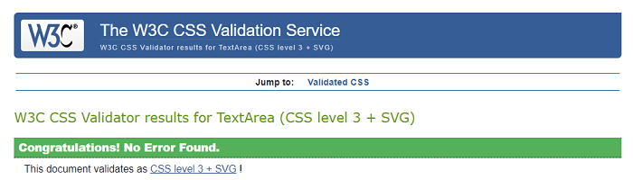
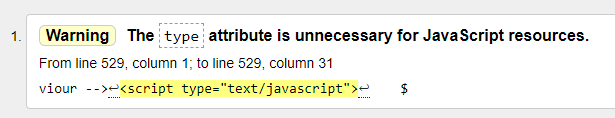
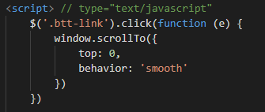
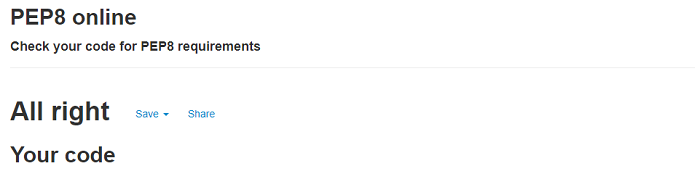
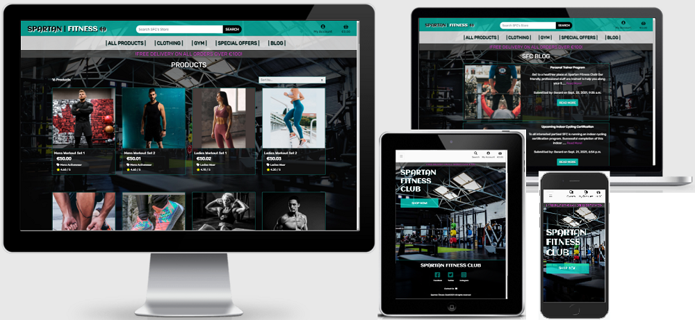
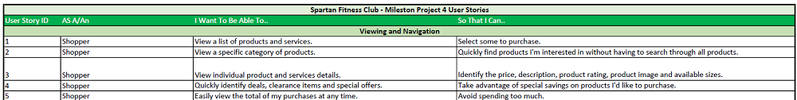
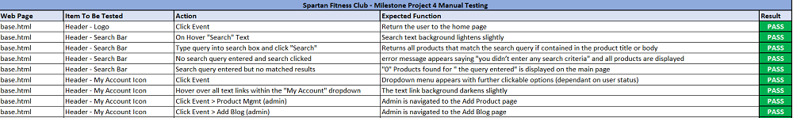

# App Testing & User Stories

# Contents

- [Code Check Validation](#code-check-validation)
- [Responsiveness of The App and Applied Testing](#responsiveness-of-the-app-and-applied-testing)
- [Physical Device Testing](#physical-device-testing)
- [Varying Browser Testing](#varying-browser-testing)
- [Using Lighthouse Chrome Dev-Tools](#using-lighthouse-chrome-dev-tools)
- [User Testing](#user-testing)
- [User Stories](#user-stories)
- [Manual Function Testing](#manual-function-testing)
- [Error Pages](#error-pages)

# Code Check Validation

## All CSS files were checked with the W3C CSS Validator

All files were validated by direct input at https://jigsaw.w3.org/css-validator/#validate_by_input

Each file was edited until there were no errors or warnings remaining.

  

## All HTML files were checked with the W3C Markup Validator 

All individual site pages were validated by URI at https://validator.w3.org/

Each file was edited until there were no errors or warnings remaining.

A warning was showing for the JS script "type" attribute which was contained in every template that has JS scripts included at the bottom.

To counter act this I have removed the type attribute and placed a comment outside the initial closing script chevron. Please see below:

  

## All Javascript code and scripts were checked with jshint

These tests were carried out by copying and pasting the JS code into the input field at https://jshint.com/

The code was edited until there were no errors but some warnings still remain.

There are multiple warnings relating to the use of "$" suggesting it is an undefined variable.

There is one reference to "Stripe" suggesting it is also an undefined variable.

I have left these as is as they are only warnings and dont impact the intended functions of the code.
  

## All Python files were assessed using Flake8 in Gitpod and PEP8 online checker. 

All .py files were initially checked in the Gitpode IDE using Flake8 lynting and hints to correct errors, spacing and line size.

After editing until no errors were present, each individual .py files contents was copy and pasted into the input field at http://pep8online.com/

The PEP8 online checker shows no errors in all .py files.

  

# Responsiveness of The App and applied Testing

The responsiveness of the website was assessed and achieved using Google Chrome Inspect Tools.

I manually assessed the views through the array of different size devices and resolutions and made adjustments to CSS until happy with its cross device display.

Please see a reference screenshot below:

  

# Physical Device Testing

The physical devices available to me for testing were: Iphone6, Iphone7, Lenovo Tablet and a Dell 15inch Laptop with extended 21inch display monitor.
  

# Varying Browser Testing

The browsers used during creation and testing phases of the APP were: Google Chrome, Mozilla Firefox and Safari.
  

# Using Lighthouse Chrome Dev-Tools

I am unfamiliar in this territory at present but took some time to install the Chrome addon package. 

I utilised the returned reports to maximise efficiencies accross the project.

The performance section varied and this is mainly due to third party script includes like jQuery, Popper and Stripe.

Please see a screenshot below of the landing page where Accessibility, Best Practices and Search Engine Optimisation have been awarded 100%

  

# User Testing 

I have received user testing feedback from two sources based on the proposed user stories, the first is a friend of mine who is a UX designer and the second is a work colleage who does a lot of online shopping.

My friend, who is the UX designer, opted to use his Iphone 10 and my work colleague used his laptop.

Both have commented that the site does exactly what you would expect it to do which for me ticks the maintaining familiaritly box.

It was also commented that it is easy to navigate and to get from selecting a product to checking out is quite quick and efficient.

Both users liked the colour scheme and the images that were used to create the SFC theme.
  

# User Stories

Please see below screenshot snippet of my user stories which are based on, and expanded from, the user stories that were utilised during the Boutique Ado project.

  

## User Story Testing

Please click on the link below which will open the pdf version of my Spartan Fitness Club user stories, found in the same directory of this TESTING_&_USER_STORIES.md document.

[SFC User Stories](Spartan_Fitness_Club_User_Stories.pdf)

The user stories have been utilised in the creation of the site and have also been used to assess real life user testing scenarios.

Please see additional requirements to my pdf document to be satisfied for a Site Owner/Standard User/Logged In User User below:

## Site Owner (promoting a return visit)

(1) As a site owner I want to maintain an excellent user experience for the site users to ensure their return.

* Maintain a professional look and feel.
* Visually appealing and keeping in line with the stores theme.
* Easily navigational and intuitive.
* Continue to add to the site with new features.

## Standard User (Shopper - not logged in)

(2) As a user I want an inviting site who's theme will be inline with the products/services they sell.

* All Products are displayed inside their own card for ease of viewing.
* Each card gives a basic overview of the product/service.
* A Modern and familiar feel to the website.
* Intuitive site navigation.
* Admin maintains Products and Blog additions.

(3) As a user I want to use my mobile device and have an app thats responsive to my device and enhances my experience.

* The site is responsive accross all devices to ensure user satisfaction.
* Mobile Phones have had the most consideration as it will most likely be the most used method.
* Buttons, links and clickable icons have been used throughout the site to ensure familiarity for the user.
* Back to top button is provided on pages where the content is sufficient to warrant it.

(4) As a user I want to be able to contact SFC if I have any questions or require information.

* A clickable email link is placed in the footer for general enquirys.
* An email link is present in all Blog posts for more information.

(5) As a user I want to be able to view SFCs social media pages so that I can follow their activity.

* Social media links are provided in the footer of the main page only.
* The links are provided using fontawesome and have de-emphasised descriptive text underneath.
* The Icons highlight on hover. If you hover the text the icon highlights blue. Clicking both will carry out the same logic.

(6) As a user I want to be able to remove items from my shopping bag so that I can opt out of the purchase.

* The user can update the items in their bag by changing & updating the quantity or the remove link.

(7) As a user I want acknowledgements so that I am aware of my purchasing & navigation actions/interactions.

* Notification messages are displayed for the following interactions:

    -	Logging in
    -	Signup Registration
    -	Email verification
    -	Add item to the cart
    -	Complete a purchase
    -	Purchase email confirmation
    -	Add a product/blog/blog comment
    -	Delete a product/blog/blog comment
    -	Edit a product/blog

(8) As a user I want to be able to learn more about SFCs upcoming events and where their sports interests lie.

* A blog page is provided, where SFC publish articles about potential upcoming events.

## Logged In User

(9) As a registered user I want to have the option to automatically save my details.

* When a user checks out the first time they can then save their details in their profile.
* When the users details are saved to their profile they will auto-fill the next time a checkout occurs.
  

# Manual Function Testing

Please see below screenshot snippet of my manual function testing document.

Please click on the link below which will open the pdf version of my Manual Testing document, found in the same directory of this TESTING_&_USER_STORIES.md document.

[SFC Manual Testing](Spartan_Fitness_Club_Manual_Testing.pdf)

Each web page has been manually tested, passed and documented. All criteria for the tests are laid out in the linked pdf.
  

# Error Pages

The following are descriptions of the error pages in the project and what they display when triggered.

These error pages will show up in the finished project when DEBUG is changed to FALSE in the main apps settings.py file.
  

## 403 Error Page

* Displays when a 403 - user cookies are not enabled error occurs.
* This tells the user that the navigation could not continue and advises the user to enable their cookies.
* Provides the user with a return home button/link.

### The Return Home Button:

* Changes color on hover (darkens).
* If clicked, returns the user to the home page.
  

## 404 Error Page

* Displays when a 404 - page not found error occurs.
* This tells the user that the page they are looking for could not be found.
* Provides the user with a return home button/link.

### The Return Home Button:

* Changes color on hover (darkens).
* If clicked, returns the user to the home page.
  

## 500 Error Page
* Displays when a 500 – internal server connection error occurs.
* Tells the user that there’s an internal server connection error.
* Provides the user with a return home button/link.

### The Return Home Button:

* Changes color on hover (darkens).
* If clicked, returns the user to the home page.
  

### End of TESTING & USER STORIES

